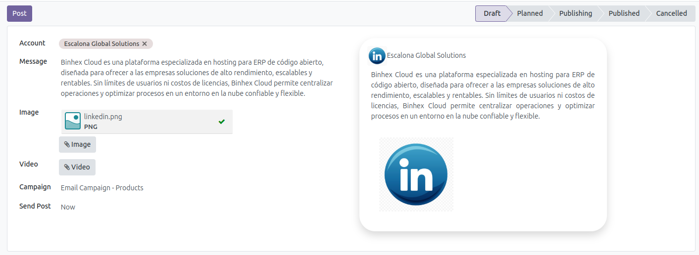
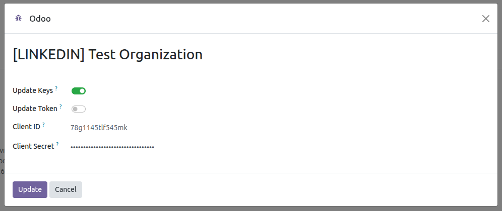

List of posts generated from Odoo.
---------------

Only posts generated using Odoo are displayed.

- Go to *Social Media* > Posts

Generate a post.
---------------

This feature acts as a template for generating multiple posts
from a single view, depending on the selected accounts.

- Go to *Social Media* > Posts > New or Go to *Social Media* > Dashboard > Add Post
- Fill in the required fields
- When the post is created, every LinkedIn account of the active company is
  selected by default in *Accounts*; remove the ones you do not want to use
  before publishing.
  
- Save
- Click on the *Post* button
- LinkedIn publishes either images or a video, never both: when the post
  carries a video, its images are left out. The preview of the post says so
  by showing the video alone, so what is previewed is what LinkedIn
  receives, and a banner on the form explains it as well.
- Posts deleted directly on LinkedIn are marked as *Deleted on LinkedIn* in
  Odoo, so the dashboard keeps their history. Only the *Full resync* button
  and the weekly scheduled action notice them, not the ordinary statistics
  synchronization, so a deletion can take up to a week to be reported.
- The images of the published post are attached to it right away. LinkedIn
  is asked for them first, and when it has not exposed them yet the local
  attachments of the post are copied instead, so the dashboard card never
  waits for the next statistics synchronization to show its image.
- The publication mirrors what is online: an image removed from the post on
  LinkedIn is dropped from the dashboard card on the next statistics
  synchronization. Only the medias downloaded from LinkedIn are managed this
  way, so a file attached by hand in Odoo is never removed.

Update token, client ID, client Secret and organization data
---------------

- Go to *Social Media* > Configuration > Accounts
- Select the account
- Click on the *Update account* button

  

- In the wizard that appears, if none of the checkboxes are selected and the
  *Update* button is pressed, the system will update only the organization's data.
- If the *Update keys* checkbox is selected, the current Client ID is proposed
  to the administrator users, the only ones allowed to read it, and the Client
  Secret has to be typed again: the stored secret is never sent to the browser.
  Authentication is then performed again through LinkedIn, and the keys are
  only written on the account once LinkedIn has accepted them, so an
  authorization left halfway keeps the credentials that still work.

  

- Selecting the *Update token* checkbox will update the current token.

  

Validate the token
---------------

- Go to *Social Media* > Configuration > Accounts
- Select the account and open the *Configuration* tab
- Click on the *Validate token* button. It always asks LinkedIn whether the
  token is still active, because a token can be revoked there long before
  the stored expiry dates: a notification confirms that it is valid, and if
  it is not, the token is renewed. Outside the renewal window, the check made
  before every call to LinkedIn uses the stored dates, so it costs no extra
  request.

  

Full resync of a page
---------------

- Go to *Social Media* > Configuration > Accounts, select the account and click
  on the *Full resync* button of the header.
- The *Update* button of the dashboard reads one page of the feed, the one
  sorted by last modification, and refreshes the figures of every publication
  by its identifier. That is enough for everything except one thing: it cannot
  notice that a publication was **deleted** on LinkedIn, because a publication
  missing from the page it read is not necessarily gone.
- *Full resync* is what reads the whole feed and marks as *Deleted on LinkedIn*
  what is no longer there. It is also the expensive pass, one call per hundred
  publications against the daily quota, so it asks for confirmation.
- The scheduled action *Social: Full resync of the accounts* does the same
  weekly for every account, so pressing the button is only needed to see a
  deletion reported sooner.
- A publication edited on LinkedIn long enough ago to have fallen off that
  first page keeps the text Odoo already had until a full resync. Its figures
  are refreshed all the same.

Archive Account Linkedin
----------------------------

- Go to *Social Media* > Configuration > Accounts
- Select the account
- Click on the *Archive account* button

  

- Please note that all data associated with this account will be archived.
- If you associate the same LinkedIn account again later, the archived
  account and its related data will be reactivated instead of creating a
  duplicate.
- An archived account can be deleted permanently with the *Delete
  permanently* button, only available to a social media administrator. The
  LinkedIn publications stay online, only the Odoo history is removed.

Uninstalling the module
----------------------------

Uninstalling *Social Media Linkedin* does not delete the accounts nor their
publication history:

- The access token and the refresh token are cleared, so no credential
  outlives the module.
- The LinkedIn accounts are archived, together with their posts.
- The LinkedIn specific data is lost, because Odoo drops the columns of an
  uninstalled module: the application Client ID and Client Secret.
- The identifier of each account and publication on LinkedIn is kept, so
  installing the module back and associating the account again reactivates
  the archived history and updates it, instead of importing everything as
  duplicated records.

Statistics of the charts
---------------

- The charts of *Social Media* > Charts group the LinkedIn statistics by
  **day** or by **month** only. The
  [`organizationalEntityShareStatistics`](https://learn.microsoft.com/en-us/linkedin/marketing/community-management/organizations/share-statistics)
  endpoint documents those two as the values of its `timeGranularityType`,
  so no other one is offered for a LinkedIn account.
- The date range has to cover at least one whole day or one whole month,
  depending on the granularity selected. LinkedIn answers an error for a
  shorter range, so it is refused before calling it.

LinkedIn tokens
---------------

- The access token of LinkedIn lasts two months and its refresh token a year,
  as stated in the
  [refresh tokens documentation](https://learn.microsoft.com/en-us/linkedin/shared/authentication/programmatic-refresh-tokens).
  Within the week before the expiry date, and on every run of the scheduled
  action *Social: Checking social media updates* and before publishing, Odoo
  asks LinkedIn whether the token is still active (`introspectToken` endpoint)
  and only renews it when LinkedIn answers that it is not. Outside of that
  window the check is answered with the stored dates and costs no request.
  Nothing has to be done for a post planned weeks ahead.
- If LinkedIn refuses the token anyway, it is renewed and the publication is
  sent again straight away.
- Once the refresh token expires, or the authorization is revoked from
  LinkedIn, no renewal is possible: the account shows the update warning and
  has to be authorized again with *Update account*, which is the only step
  that needs the browser.

LinkedIn limits and validations
---------------

- The text of the post is **not** checked in Odoo: the `commentary` field of
  the
  [Posts API](https://learn.microsoft.com/en-us/linkedin/marketing/community-management/shares/posts-api)
  limits the body of a publication to 3.000 characters. A longer text fails
  when it is sent and the line is left as *Failed* with the validation error
  LinkedIn answers, so check the length before publishing.
- The number of images is not checked either: one image is published as a
  single image and two or more as a
  [multi-image post](https://learn.microsoft.com/en-us/linkedin/marketing/community-management/shares/multiimage-post-api).
  Its limits are applied by LinkedIn when it receives the post, so a number of
  images it does not accept is only detected when publishing.
- LinkedIn publishes **JPG, PNG and GIF** images and **MP4** videos. Any other
  format is announced on the post as soon as it is attached and refuses the
  publication of that line, which is left as *Failed* naming the file. The
  images are only checked when the post carries no video, because a video
  leaves them out anyway.
- Every call to LinkedIn has a timeout of **10 seconds**, not configurable. If
  LinkedIn or the connection take longer, the operation fails with *Error
  connecting to LinkedIn* and has to be retried; a publication is left as
  *Failed* and can be sent again with the *Post* button.
- An account without an access token does not publish: this is what happens
  after uninstalling and installing the module back, which clears the
  credentials. The line is left as *Failed* stating that the account has no
  access token, and the account shows the update warning. Authorize it again
  with *Update account*.
- The
  [Reactions API](https://learn.microsoft.com/en-us/linkedin/marketing/community-management/shares/reactions-api)
  only accepts **one reaction per account**: liking a publication that was
  already liked answers *You have already reacted to this post.*, and the
  reaction cannot be withdrawn from Odoo. If the publication was deleted on
  LinkedIn, the message is *The post does not exist or has been deleted.*
- Deleting a publication from the dashboard deletes it on LinkedIn first. If
  LinkedIn does not confirm the deletion, the operation is cancelled with
  *Error deleting LinkedIn post* and the record is kept in Odoo, so the two
  sides never get out of sync.

Errors reported by LinkedIn
---------------

- When LinkedIn rejects a request because of its content, its answer only
  says that the validation failed and lists the rejected fields apart, in
  the shape described in its
  [error handling guide](https://learn.microsoft.com/en-us/linkedin/shared/api-guide/concepts/error-handling).
  Those explanations are the ones shown in Odoo, one per line, so the
  message names the field and the rule that was broken instead of the
  generic summary.
